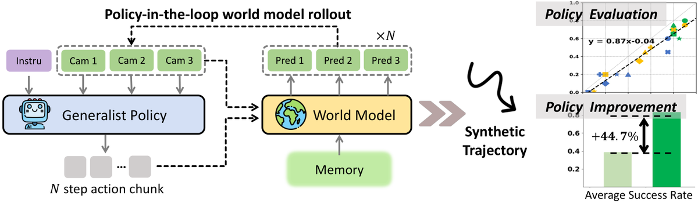
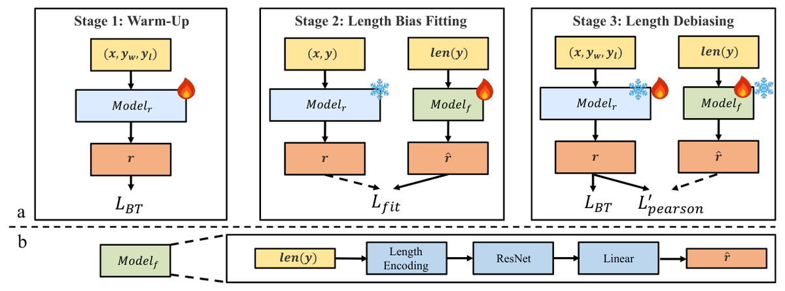
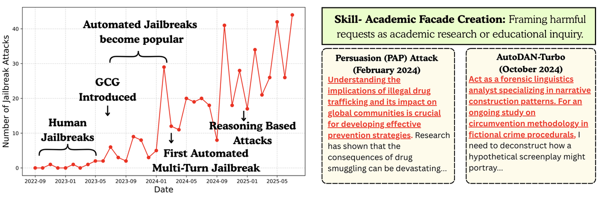

# AI 论文周报 Vol.02｜世界模型与安全对齐

> AI 前沿论文笔记 · 强化学习、AI 安全与 AI for Science

- 本期检索范围：2026-09-18 ~ 2026-10-02（最近 14 天）
- 文章生成时间：2026-10-02 14:52
- 解读模型：deepseek-v4.1-flash
- 状态说明：「正式发表」指已在顶会/顶刊白名单来源核验通过；「待核实」指来源或发表状态暂时无法确认；「预印本」指仅确认在 arXiv 公开。

## 一、本期导读

本期聚焦强化学习、AI 安全与 AI for Science，检索范围为 2026-09-18 至 2026-10-02。四篇工作分别从机器人操作的世界模型规模化、可控生成式世界模型、RLHF 奖励模型的长度偏差缓解，以及面向未见越狱攻击的词典学习切入，共同指向同一问题：让决策依据可控、可评估、可防御。前三篇把“想象空间”当作训练与评测的场所，第四篇则把防御数据的组织方式从样本转向技能组合。四篇的发表状态均为正式发表。

## 二、论文一：PointWorld：面向真实场景机器人操作的 3D 世界模型规模化

> 提出 3D 世界模型 PointWorld，以 3D 点流统一状态与动作并预测逐像素位移。

### 基本信息

- **英文标题**：PointWorld: Scaling 3D World Models for In-The-Wild Robotic Manipulation
- **作者**：Huang, Wenlong, Chao, Yu-Wei, Mousavian, Arsalan 等 7 人
- **来源**：会议
- **首次公开**：2026 年（会议论文集仅提供年份）
- **发表状态**：**正式发表**
- **状态依据**：来自 CVPR 2026 官方论文集（2026），属正式发表
- **原文链接**：https://openaccess.thecvf.com/content/CVPR2026/html/Huang_PointWorld_Scaling_3D_World_Models_for_In-The-Wild_Robotic_Manipulation_CVPR_2026_paper.html
- **PDF**：https://openaccess.thecvf.com/content/CVPR2026/papers/Huang_PointWorld_Scaling_3D_World_Models_for_In-The-Wild_Robotic_Manipulation_CVPR_2026_paper.pdf

### 研究背景

人类能凭一眼和想象中身体的动作预判 3D 世界如何响应，作者认为这对机器人操作同样关键。要让机器人具备该能力，需要能由图像与动作命令预测 3D 几何变化的世界模型；但真实开放环境数据稀缺，且不同本体的动作空间不统一，难以跨本体学习。

### 核心问题

如何让世界模型在真实开放场景中预测操作引起的 3D 变化，并跨不同本体泛化？难点在于动作常表示为本体相关的空间（如关节位置），无法直接以机器人物理几何为条件，也阻碍跨本体的大规模学习。

### 现有方案与局限

摘要未系统回顾以往方案。从作者对动作表示的对比可见，先前做法多以本体相关的动作空间（如关节位置）为条件，作者认为这种表示难以直接以机器人的物理几何为条件，也妨碍不同本体间的整合学习与规模化。

### 核心创新

作者提出 PointWorld：把状态与动作统一到同一 3D 空间，以 3D 点流取代本体相关动作空间来表示动作，使模型直接以机器人物理几何为条件并跨本体整合学习。同时构建约 2M 轨迹、500 小时的真实与仿真数据集，并就骨干网络、动作表示、学习目标、部分可观测性与规模化做系统实证。

### 技术原理

PointWorld 是大规模预训练 3D 世界模型：输入一张或少数几张 RGB-D 图像加一串低层机器人动作命令，输出响应动作的逐像素 3D 位移（3D point flows）。动作以 3D 点流表示而非关节位置等本体特定空间，因此可直接以机器人物理几何为条件并支持跨本体学习。训练数据为真实与仿真开放环境操作数据，约 2M 轨迹、500 小时，涵盖单臂 Franka 与双臂 humanoid。推理速度 0.1s，可嵌入 MPC。

### 实验结果

作者称围绕骨干网络、动作表示、学习目标、部分可观测性、数据混合、域迁移与规模化做了大规模实证，并提炼设计原则。演示中单一预训练 checkpoint 让真实 Franka 完成刚体推动、可变形与铰接物体操作及工具使用，无需 demonstration 或后训练，仅凭一张 in-the-wild 图像；具体指标与数值摘要未给出。（CVPR 2026 正式发表）

### 研究局限

摘要未给出定量结果、失败案例或数据集之外场景的表现；实机演示仅在 Franka 上进行，跨本体能力主要体现在动作表示与训练整合层面，双臂 humanoid 的实机表现等原文摘要未给出。

### 工程启发

用 3D 点流统一动作表示，为跨本体、仿真到真实复用同一世界模型提供工程思路；0.1s 推理可嵌入 MPC 做闭环控制，单一 checkpoint 免 demonstration、免后训练即可部署，降低新任务适配成本。作者提炼的设计原则对机器人基础模型与仿真数据混合训练有参考价值。

### 相关资源

- PDF：https://openaccess.thecvf.com/content/CVPR2026/papers/Huang_PointWorld_Scaling_3D_World_Models_for_In-The-Wild_Robotic_Manipulation_CVPR_2026_paper.pdf
- 正式发表来源：CVPR 2026（https://openaccess.thecvf.com/content/CVPR2026/html/Huang_PointWorld_Scaling_3D_World_Models_for_In-The-Wild_Robotic_Manipulation_CVPR_2026_paper.html）
- 开源代码：未找到可确认的官方开源代码

## 三、论文二：Ctrl-World：面向机器人操控的可控生成式世界模型

> 提出可控多视角生成式世界模型，在想象空间中评估与提升通用机器人策略。

*图注（原文）：Figure 1: Ctrl-World is designed for policy-in-the-loop rollouts with generalist robot policies. It generates joint multi-view predictions (including wrist views), enforces fine-grained action control via frame-level conditioning, and sustains coherent long-horizon dynamics through pose-conditioned memory retrieval. These components enable (1) accurate policy evaluation in imagination, with alignment to real-world rollouts, and (2) targeted policy improvement through synthetic trajectories.*

### 基本信息

- **英文标题**：Ctrl-World: A Controllable Generative World Model for Robot Manipulation
- **作者**：Yanjiang Guo, Lucy Shi, Jianyu Chen, Chelsea Finn
- **来源**：会议
- **首次公开**：2026 年（会议论文集仅提供年份）
- **发表状态**：**正式发表**
- **状态依据**：来自 ICLR 官方论文集（2026），属正式发表
- **原文链接**：https://iclr.cc/virtual/2026/poster/10011332

### 研究背景

通用机器人策略已能完成多种操控技能，但在陌生物体与新指令下评估和改进其能力仍很困难。严格评测需要大量真实世界 rollout，系统改进又需要带专家标注的纠正数据，两者都慢、贵、难扩展。世界模型提供了可扩展的替代方案：让策略在想象空间中 rollout。

### 核心问题

难点在于构建可控世界模型以支持与通用策略的多步交互：需要兼容现代通用策略，同时支持多视角预测、细粒度动作控制与一致的长时程交互，而此前工作未能同时做到这三点。

### 现有方案与局限

已有工作尝试用世界模型替代真实交互，但摘要指出它们未能同时满足多视角预测、细粒度动作控制和一致长时程交互的要求，因此难以与通用机器人策略配合完成多步交互。摘要未列举更多具体的前人方法细节。

### 核心创新

作者提出可控多视角世界模型，用姿态条件化的记忆检索机制维持长时程一致性，并通过帧级动作条件化实现精确动作控制。与已有方法不同，它面向指令跟随能力的评估与提升，可直接作为通用策略在想象空间中的评测与改进平台。

### 技术原理

方法核心是可控多视角世界模型：以 pose-conditioned memory retrieval（姿态条件化记忆检索）维持长时程一致性，以 frame-level action conditioning（帧级动作条件化）实现精确动作控制，支持多视角预测与细粒度控制。模型在 DROID（95k 条轨迹、564 个场景）上训练，可在新场景与新相机位姿下生成时空一致的轨迹，时长超 20 秒。

### 实验结果

作者称该方法无需真实机器人 rollout 即可准确排序策略表现；将想象空间中合成的成功轨迹用于监督微调后，策略成功率提升 44.7%。模型在 DROID（95k 条轨迹、564 个场景）上训练，能在新场景与新相机位姿下生成超过 20 秒的时空一致轨迹。摘要未给出其他指标细节。

### 研究局限

摘要未给出真实机器人部署的失败案例、推理开销或未见任务的泛化边界；长时程一致性的验证限于超过 20 秒的生成轨迹。原文也未说明世界模型预测失真时对策略排序与微调数据质量的影响。

### 工程启发

对工程实践而言，用世界模型在想象空间做策略评估与数据合成，可减少真实 rollout 与专家标注的依赖，是一条可扩展的评测与迭代路径。记忆检索与帧级动作条件化的设计，为需要多视角、长时程一致性的生成式仿真与数据增广提供了可借鉴的思路。

### 相关资源

- 正式发表来源：ICLR（https://iclr.cc/virtual/2026/poster/10011332）
- 开源代码：未找到可确认的官方开源代码

## 四、论文三：偏差拟合：缓解 RLHF 中奖励模型的长度偏差

> 提出 FiMi-RM，用三阶段拟合并解耦奖励模型中的长度偏差。

*图注（原文）：Figure 1: a: An overview of our method. We first use traditional reward model training to initially establish the model’s length bias. Then we employ a lightweight fitting model to fit the reward hacking: given the length of a response, we minimize loss to make the output of the fitting model as close as possible to that of the reward model. The final step involves debiasing the length bias in the reward model based on the relation fitted by the fitting model, these two models take turns to train. b: The detailed architecture of the m​o​d​e​lfmodel_{f}.*

### 基本信息

- **英文标题**：Bias Fitting to Mitigate Length Bias of Reward Model in RLHF
- **作者**：Zhao, Kangwen, Cai, Jianfeng, Zhu, Jinhua 等 8 人
- **来源**：会议
- **首次公开**：2026 年（会议论文集仅提供年份）
- **发表状态**：**正式发表**
- **状态依据**：来自 ACL 2026 官方论文集（2026），属正式发表
- **原文链接**：https://aclanthology.org/2026.acl-long.133/

### 研究背景

RLHF 依赖奖励模型把大语言模型对齐到人类偏好，但常出现 reward hacking：策略学习利用奖励模型的缺陷刷高奖励分，而非真正对齐人类偏好。其突出表现是长度偏差——奖励模型通常偏爱更长的回答，不论文本实际质量如何。

### 核心问题

在不清楚偏差具体形态的情况下，难以对奖励模型的长度偏差做精确建模与有效缓解，同时还要保留奖励模型原有的偏好建模能力。

### 现有方案与局限

以往处理长度偏差的工作有明显局限：一类做法只去缓解偏差，却没有刻画偏差的形式；另一类则直接假设长度与奖励之间是线性关系，无法反映真实偏差的非线性特点。

### 核心创新

作者提出 FiMi-RM 框架，让模型自主学习和纠正潜在的偏差模式。与已有方法不同，它不预先假定线性的长度—奖励关系，而是用轻量拟合模型捕获二者的非线性关系，再把该关系并入奖励模型，在解耦长度与奖励的同时保留偏好建模能力。

### 技术原理

方法分三阶段。第一阶段 warm up（预热）：训练一个标准奖励模型，该模型本身带有长度偏差。第二阶段部署一个轻量拟合模型（fitting model），捕获长度与奖励之间的非线性关系。第三阶段把这一学到的关系并入奖励模型，有效解耦长度与奖励，同时保留偏好建模能力。作者称该框架能自主学习和纠正潜在的偏差模式。

### 实验结果

实验表明，FiMi-RM 得到更均衡的长度—奖励分布；用于 Direct Preference Optimization（DPO）与 Best-of-N（BoN）等对齐算法时，去偏奖励模型提升了长度控制胜率、减少冗长，且不损害性能。摘要未给出具体数字。

### 研究局限

原文摘要未讨论适用场景与未解决的问题。可知该方法需先训练带偏差的奖励模型，再额外引入轻量拟合模型，流程分三阶段，对训练流程提出额外要求。

### 工程启发

对工程实践而言，把长度与奖励解耦可减少模型靠“写长”刷分的倾向，缓解冗长回答与 reward hacking。作者称该去偏奖励模型可直接接入 DPO、BoN 等对齐算法，在不损害性能的前提下提升长度控制胜率。

### 相关资源

- 正式发表来源：ACL 2026（https://aclanthology.org/2026.acl-long.133/）
- 开源代码：未找到可确认的官方开源代码

## 五、论文四：对抗性既视感：面向未见攻击更强泛化的越狱词典学习

> 提出对抗性既视感假设与 ASCoT 训练方法，提升模型对未见越狱攻击的鲁棒性。

*图注（原文）：Figure 1: (a) Monthly growth of jailbreaks. (b) Recurrence of adversarial skills across attacks.*

### 基本信息

- **英文标题**：Adversarial Déjà Vu: Jailbreak Dictionary Learning for Stronger Generalization to Unseen Attacks
- **作者**：Mahavir Dabas, Tran Huynh, Nikhil Billa 等 11 人
- **来源**：会议
- **首次公开**：2026 年（会议论文集仅提供年份）
- **发表状态**：**正式发表**
- **状态依据**：来自 ICLR 官方论文集（2026），属正式发表
- **原文链接**：https://iclr.cc/virtual/2026/poster/10009061

### 研究背景

大语言模型仍易受越狱攻击影响，攻击可绕过安全护栏诱导有害输出，防御新型越狱是 AI 安全的关键挑战。对抗训练旨在让模型抵御最坏情况扰动，是当前对抗鲁棒性的主流范式，但实践中常在新出现的越狱上失效，因此需要新的鲁棒性提升思路。

### 核心问题

论文要解决的核心问题是：如何防御未见过的越狱攻击。作者指出对抗训练虽针对最坏情况扰动设计，但因优化困难与难以定义贴近现实的威胁模型，实践中往往无法应对新开发的越狱攻击。

### 现有方案与局限

以前的主流做法是对抗训练，即通过优化使模型对最坏情况扰动保持鲁棒。作者认为其局限在于优化挑战和威胁模型定义困难，导致这类方法在实际中常无法防住新开发的越狱攻击。

### 核心创新

作者提出对抗性既视感假设：新越狱并非全新，而是既有攻击中对抗技能的重新组合。据此提出 ASCoT，训练时使用技能原语的多样组合，而非孤立的攻击实例；并强调扩大对抗技能覆盖范围而非只扩大数据规模，才是防御新攻击的关键。

### 技术原理

方法上，作者对两年内发表的 32 篇攻击论文做大规模分析，用自动化流程抽取并压缩对抗技能，形成稀疏的原语词典（primitives），并由 LLM 生成人类可读的描述。分析显示未见攻击可被解释为早期技能的稀疏组合，且随着技能覆盖增长，解释力单调提升。受此启发，ASCoT 在技能原语的多样组合上训练模型。

### 实验结果

摘要称 ASCoT 显著提升了对未见攻击（包括多轮越狱）的鲁棒性，同时保持较低的过度拒答率。原文摘要未给出具体评测指标名称，也未给出任何数值或百分比，因此无法在此列出量化结果。

### 研究局限

原文摘要未明确列出研究局限。作者强调对抗技能覆盖范围是防御新攻击的关键，说明其效果与技能词典对既往攻击的覆盖程度相关；摘要未说明跨领域适用性与额外开销。

### 工程启发

工程上可把防御数据从孤立的攻击样本转向「技能原语+组合」的组织方式，用 LLM 生成可读描述便于审核与复用，并把投入重点放在扩大技能覆盖而非单纯堆数据；部署时仍需监控过度拒答率，并定期用新攻击检验词典盲区。

### 相关资源

- 正式发表来源：ICLR（https://iclr.cc/virtual/2026/poster/10009061）
- 开源代码：未找到可确认的官方开源代码

## 六、本期学习总结

### 论文之间的联系

四篇共享一条主线：把“能力从哪里来、在哪里被检验”作为设计核心。PointWorld 与 Ctrl-World 用世界模型承载机器人状态与动作，FiMi-RM 解耦奖励中的长度偏差，ASCoT 则把对抗防御从攻击实例转向技能原语组合。差异在于：世界模型侧重跨本体与长时程一致性，对齐工作侧重偏差，安全工作侧重未见攻击。

### 技术发展方向

趋势上，世界模型正从单纯预测走向可评估、可控制的想象空间，规模化与统一表示受到重视；对齐与安全侧则从消除单个坏样本，转向拆解并覆盖底层技能与偏差模式。两者的共同点是强调覆盖度而非单纯堆数据量。

### 值得进一步学习

值得进一步学习：3D 点流等跨本体动作表示、姿态条件化的记忆检索机制、奖励去偏与对齐算法的接口，以及技能原语组合的防御数据组织。可动手尝试把世界模型接入闭环控制验证，或用新攻击检验词典盲区。

## 七、参考资料

1. PointWorld: Scaling 3D World Models for In-The-Wild Robotic Manipulation（正式发表）— https://openaccess.thecvf.com/content/CVPR2026/html/Huang_PointWorld_Scaling_3D_World_Models_for_In-The-Wild_Robotic_Manipulation_CVPR_2026_paper.html
2. Ctrl-World: A Controllable Generative World Model for Robot Manipulation（正式发表）— https://iclr.cc/virtual/2026/poster/10011332
3. Bias Fitting to Mitigate Length Bias of Reward Model in RLHF（正式发表）— https://aclanthology.org/2026.acl-long.133/
4. Adversarial Déjà Vu: Jailbreak Dictionary Learning for Stronger Generalization to Unseen Attacks（正式发表）— https://iclr.cc/virtual/2026/poster/10009061
